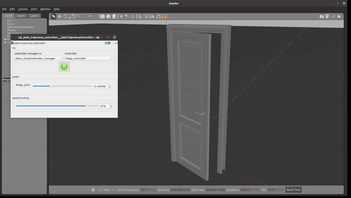

# door-simulator

<p align="center">
  
</p>

## Summary
Using ROS and Gazebo, door mechanisms are simulated (including the door hinge, handle, and latch). In addition, the door knob dataset can be used to swap the default handle with a desired configuration.

## Directory Structure
```
door-simulator                 # Door Simulator Project
├── door                       # door package
├── config                     # config folder
    ├── config.yaml
    ├── joint_names_complete_door_1.yaml
    ├── rviz.rviz
├── launch                     # launch folder for launch files
    ├── control.launch
    ├── display.launch
    ├── gazebo.launch
├── meshes                     # meshes folder for stl files
    ├── door.stl
    ├── frame.stl
    ├── handle.stl
    ├── latch.stl
├── urdf                       # urdf folder urdf files
    ├── door_fixed.gv
    ├── door_fixed.pdf
    ├── door_fixed.urdf        # urdf description of the door model
├── CMakeLists.txt             # compiler instructions
└── package.xml                # package info
```

## Requirement
* Ubuntu 20.04
* ROS 1 Noetic
* Python 3.8
* Gazebo 11 Simulator

## Build and Launch

1. Clone and initialize project with a catkin workspace
```sh
$ mkdir -p catkin_ws/src && cd ~/catkin_ws/src
$ git clone https://github.com/koki-shin/door-simulator.git
$ catkin_init_workspace
```

2. Move back to `catkin_ws\` and build
```
$ cd ~/catkin_ws 
$ catkin_make
```

3. To spawn the controllers and the model in gazebo:
```
$ source devel/setup.bash
$ roslaunch door_fixed control.launch
```

## Usage


## Contact
Koki Shin - kokishin@tamu.edu

Project Link: https://github.com/koki-shin/door-simulator

## References
Reference Model: https://grabcad.com/library/door-2000x700x40mm-1
